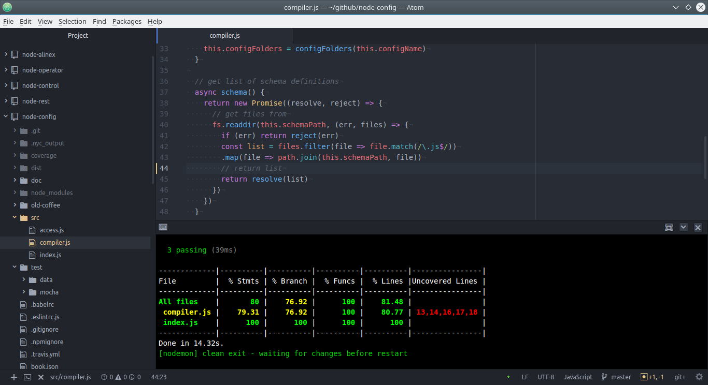

# Editor

Nearly every IDE and Editor supports JavaScript more or less. In fact you can also
use just the simplest editor like `vi`.
But the editor still plays a major role in writing good code.

Editors often allow
- syntax highlighting
- code completion
- syntax checking
- integrated linter
- integrated git
- and more...

Select the editor which have all the tools you need and is appealing and easy to
use in its behavior for you.


## Atom

After using Sublime Text 3 for some time I was impressed about [Atom](https://atom.io/).
Atom is mostly based on JavaScript itself to be easy expendable with plugins. Because of
that there are a lot of extensions for nearly every language and need.
Now atom really grew to a full fledged IDE.



### Installation

That is an easy task, only download and install it directly from their homepage.

After that you may install the needed plugins, but only install what you really needs
else it may get bloated. To reset everything remove the directory `~/.atom`.

### General Plugins
- atom-ide-ui - tools for ide
- character-table - to easy find any utf character

__Maybe also__
- project-manager - helps to switch between different workspaces
- highlight-selected - show all occurrences of the selected text
- markdown-pdf - transform markdown into pdf
- pdf-view - view pdf files inline
- open-in-browser - to open html from the project tree
- keybinding-cheatsheet - display possible keys
- tool-bar-atom - customizable toolbar

### Programming

- docblockr - helper to write inline documentation
- todo-show - opens a pane for all todos
- split-diff - shows visual diff between split panes
- atom-beautify - highlight some included languages
- pigments - color display on definition
- platformio-ide-terminal - integrated console
- atom-ternjs - auto completion
- linter-json-lint - JSON linter

__TypeScript__
- ide-typescript - language support
- linter-tslint - TypeScript linter

__ES.Next & Co__
- linter-eslint - included linting
- flow-ide - to lint flow syntax and autocomplete
- autocomplete-modules - for require/import auto completion

Also there are language and linter plugins for nearly every language and script
you use.


## Basic Shortcuts

At first it is very easy and a lot like sublime. The major shortcut to know for a
command search is: `Ctrl+Shift+p`

Additionally the following may be helpful:

- `Ctrl-\` will toggle the file tree view
- `Alt-\` switch focus to/from tree view
- `Ctrl-T` open fuzzy find for files in current project
- `Ctrl-B` open fuzzy search to search in open files
- `Alt-Shift-P` switch projects (using project-manager)

### Editing

Move Cursor

- `Ctrl-Left` move to beginning of word
- `Ctrl-Right` move to end of word
- `Ctrl-G` go to line (line:column)

Edit

- `Ctrl-Up` / `Ctrl-Down` moves the current line or selected lines up/down

Multi cursor

- `Alt-Shift-Up` / `Alt-Shift-Down` adds another cursor one line above/below
- `Strg-Click` add or remove another cursor
- `Strg-D` / `Strg-U` ad and remove cursor at the next match of selected word
- `ESC` to remove multi cursor and go back to a single one

Maybe extend the key mapping with the following:

```cson
'.platform-linux atom-text-editor':
  'shift-alt-L': 'editor:split-selections-into-lines'
```

### Code Specific Helpers

Show Help

- `Ctrl-Shift-M` shows a rendered preview (realtime)
- `Alt-Shift-T` shows the todo list (using todo-show)

### Using Git

Modify

- `Ctrl-Shift-H` show menu of all git commands
- `Ctrl-Shift-A` adds new files
- `Ctrl-Shift-A S` show status of files
- `Ctrl-Shift-A C` commit changes (give a message and save Ctrl-S)
- `Ctrl-Shift-A P` add all changed files and commit + push to remote
