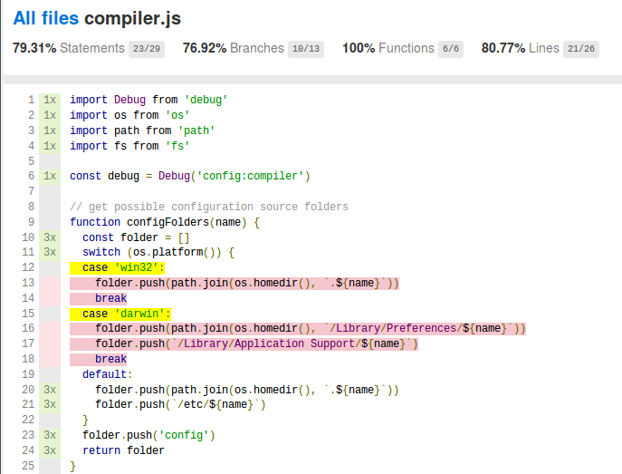
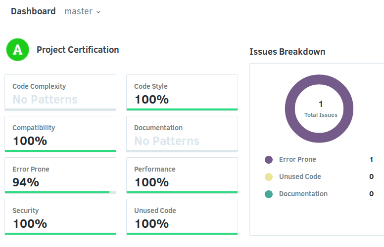

# Continuous Integration


## Travis CI

Travis is an online service for continuous integration tests which is free for open
source projects and plug-in nicely with GitHub repositories.

To use it, you can log in using your GitHub account and then register the needed
webhook to get automatically informed on code changes.

To configure how it works a `.travis.yml` file is needed which looks like:

``` yaml
language: node_js
node_js:
  - "4"  # LTS   from 2015-10 maintenance till 2018-04
  - "6"  # LTS   from 2016-10 maintenance till 2019-04
#  - "7"  # devel from 2016-10
#  - "8"  # LTS   from 2017-10 maintenance till 2019-12
#  - "9"  # devel from 2017-10

# Fix the c++ compiler on Ubuntu 14.04
env:
  - CXX=g++-4.8
addons:
  apt:
    sources:
      - ubuntu-toolchain-r-test
    packages:
      - g++-4.8
```

This will run the tests on all defined NodeJS versions just shortly after you commited
to master.

Travis will:
- start a new virtual machine
- install the required node version
- install additional needed tools
- load the code from github
- install the npm packages
- run `npm test`
- check the exit code

Afterwards you can also view the complete log online to check what went wrong.

You can also use a badge on your `README.md` like:

``` markdown
[](
  https://travis-ci.org/alinex/node-rest)
```


## Coverage

To also get a coverage report on your code you may use `istanbul` through its CLI
application `nyc`:

``` bash
$ npm install nyc --save-dev
```

And then change the test call in `package.json` to:

``` json
  "test": "nyc --require babel-core/register mocha test/mocha",
```

This will give a pretty output on call:

``` bash
$ npm run test

Server listening on http://localhost:1974
  rest server
    ✓ should give name and version number

  1 passing (44ms)

Server stopped.
------------|----------|----------|----------|----------|----------------|
File        |  % Stmts | % Branch |  % Funcs |  % Lines |Uncovered Lines |
------------|----------|----------|----------|----------|----------------|
All files   |    54.44 |    34.21 |    31.82 |    55.06 |                |
 src        |    78.95 |       65 |       75 |    81.08 |                |
  server.js |    78.95 |       65 |       75 |    81.08 |... 59,83,84,85 |
 src/api    |    31.25 |        0 |     7.14 |    31.25 |                |
  bear.js   |       20 |        0 |        0 |       20 |... 71,74,75,76 |
  index.js  |    61.54 |        0 |       50 |    61.54 | 19,21,24,25,29 |
 src/models |      100 |      100 |      100 |      100 |                |
  bear.js   |      100 |      100 |      100 |      100 |                |
------------|----------|----------|----------|----------|----------------|
```

An report is build under `coverage/lcov-report/index.html`.




### Report on Coveralls

[Coveralls](https://coveralls.io/) is another online tool (free for open source)
which enables you to load the coverage information up and displays reports with
source view online.

To bring this up also install:

``` bash
$ npm install coveralls --save-dev
```

And then make a test call for travis in `package.json` to:

``` json
  "test-travis": "nyc --reporter=lcov --require babel-core/register --require babel-polyfill mocha test/mocha",
```

To use this script from travis and sending the results back to coveralls add the following
lines to `.travis`:

``` yaml
script: "npm run-script test-travis"
# Send coverage data to Coveralls
after_script: "cat coverage/lcov.info | node_modules/coveralls/bin/coveralls.js"
```

Now you may also add the badge:

```markdown
[](
  https://coveralls.io/r/alinex/node-rest)
```

### Alternatives

You may also report to [CodeCov](https://codecov.io/) which is also free for open
source using:

```bash
# install
$ npm install codecov --save-dev

# use as after_script in travis:
node_modules/.bin/codecov --token=:token
```

Or use [Codacy](https://www.codacy.com/) also for coverage report:

```bash
# install
$ npm install codacy-coverage --save-dev

# use as after_script in travis:
CODACY_PROJECT_TOKEN=<secret trepo token> cat coverage/lcov.info | node_modules/.bin/codacy-coverage
```


## Code Quality

You may also report to [Codacy](https://codacy.com.com/) which is also free for open
source using. This will analyze the code and display different metrics available based
on the used languages.

```bash
# install
$ npm install codacy-coverage --save-dev

# use as after_script in travis:
node_modules/.bin/codecov --token=:token
```



It will also show details to all the measurements.

Now you may also add the badge:

```markdown
[](
  https://www.codacy.com/app/alinex/node-rest/dashboard)
```
