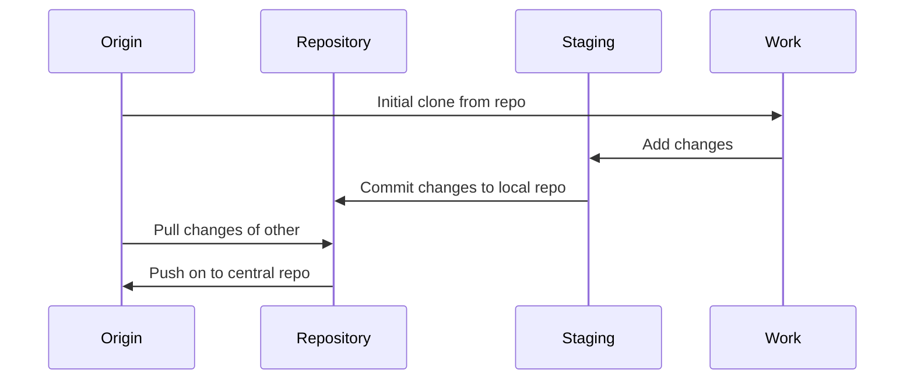

# Version Control System

Version control is the only reasonable way to keep track of changes in code and
documentation. It allows to step back to any previous version easily.
But the really big advantage comes if multiple developers work together.

There are some different version control systems available but after the use of git
since some time it was clear to go on with it. Not only because it is good but also
because it has a lot of other advantages coupled with GitHub.


## Git

[Git](https://git-scm.com/) is a free and open source distributed version control
system designed to handle everything from small to very large projects with speed
and efficiency.

Git is easy to learn and has a tiny footprint with features like cheap local branching,
convenient staging areas, and multiple workflows.

Read more in the [Git book](https://git-scm.com/book/en/v2)

The general workflow is like:




### Installation

At first install the repository software and CLI:

```bash
$ sudo apt-get install git-all
```

The setting of the default user will tell Git that you don’t want to type your
user name and email every time your computer talks to Git.

```bash
# use the settings you use on the central origin repository (maybe GitHub)
$ git config --global user.name alinex
$ git config --global user.email info@alinex.de
```

__Password caching__

To also keep Git from asking for your password every time, you need to turn on the
credential helper so that Git will save your password in memory for some time:

```bash
$ git config --global credential.helper cache
```

This will keep the password for 15 minutes in memory. But you can also have Git
store your credentials permanently using the following:

```bash
$ git config --global credential.helper store
```

Note: While this is convenient, Git will store your credentials in clear text in a
local file `.git-credentials` under your “home” directory


### Basic work flow

The most common commands are shown in the following work flow. Here everything is
shown using CLI calls but you may use with any Git tool or your editors integration
for Git.

To work on a project you have to clone it first:

```bash
$ git clone <repository url>
$ cd <repo dir>
```

This will create a complete clone of the whole repository in a subdirectory with the
last name of the repository url.

Now you may go into it and change something. Afterwards you have to add the changes:

```bash
$ git add -A <changed path>
```

If one change is done commit it with a short descriptive message (will be asked
interactively):

```bash
$ git commit
```

Later if your whole work is done you can push your local changes to the origin server
so that other developers will also get them.

```bash
$ git pull    # first pull the changes of others and merge them (automatically)
$ git push    # now send your own changes
```

If you reached a new major, minor or bug fix version or also a special state of the code you should
add a tag to get this version easily later:

```bash
$ git tag -a v1.4.0 -m 'version 1.4.0 with ....'
```

Here a new version 1.4.0 is tagged.

### Branching

The organization of branches may be differ on your needs, you may use Git here
in different ways:
- __Historical branching__ there the `master` branch stores the official release
history, and the `develop` branch serves as an integration branch for features.
It's also convenient to tag all commits in the `master` branch with a version number.
- __Feature branches__ with each new feature residing in its own branch, which can
be pushed to the central repository for backup/collaboration. But, instead of
branching off of `master`, feature branches use `develop` as their parent branch.
When a feature is complete, it gets merged back into `develop`.
- __Release branches__ there once `develop` has acquired enough features for a release  
a `release` branch is forked off of `develop`. Only bug fixes, documentation generation,
and other release-oriented tasks should go in this branch. Once it's ready to ship,
the `release` gets merged into `master` and tagged with a version number. In addition,
it should be merged back into `develop`, which may have progressed since the release
was initiated.
- __Maintenance branches__ are used as `hotfix` branch to quickly patch production releases.
This is the only branch that should fork directly off of `master`. As soon as the fix is
complete, it should be merged into both `master` and `develop`. `master` should be tagged
with an updated version number.

An full example of the different types of branches put together:


But that's only one possibility, every organization is free to use branching as they
need but it is important to clearly decide and communicate the proper way used within
the organization.

Create a new branch using:

```bash
$ git checkout -b <name>
```

Show the current branch:

```bash
$ git branch
```

Switch between branches:

```bash
$ git checkout <name>
```

To merge it with the master:

```bash
$ git checkout master
$ git merge <name>
```

To remove the branch after done:

```bash
$ git branch -d <name>
```

To sync the changes use (for all branches):

```bash
$ git pull --all
$ git push --all
```


### Special use cases

__Moving repository__

First you have to fetch all remote branches:

```bash
$ git fetch origin
```

Now check if all branches are local:

```bash
$ git branch -a
```

If there are some branches listed as remote which didn’t exist as local ones you
have to check them out:

```bash
$ git checkout -b <name> origin/<name>
```

Now define a new remote repository:

```bash
$ git remote add new-origin <url>
```

Everything set up so you may transfer the repository:

```bash
$ git push --all new-origin
$ git push --tags new-origin
```

At last you may delete the old origin and rename it:

```bash
$ git remote rm origin
$ git remote rename new-origin origin
```

Pull/push to origin

Use the preset names:

```bash
$ git pull origin master
$ git push origin master
```

__Subversion Integration__

If you have a subversion server as master you may also use git for your work and sync the changes back to subversion as the master repository.

To use this you have to install the extension:

```bash
$ apt-get install git-svn
```

To do so you first init your git repository from the subversion master and load the initial data:

```bash
$ git svn clone -s https://github.com/alinex/my-repo
# -s is for --stdlayout which presumes the svn recommended layout for tags, trunk, and branches
```

If you don’t want the complete history you may use:

```bash
$ git svn clone -s -r 40000:HEAD https://github.com/alinex/my-repo
# -r is for the revision to start taking history from
```

To update your repository to HEAD of subversion master run:

```bash
$ git svn rebase
```

And to push your commits further to subversion:

```bash
$ git svn dcommit
```

__Working with forks__

If you have a fork you may add an additional remote repository:

```bash
$ git remote add upstream
```

To sync this you have to:

```bash
$ git fetch upstream
$ git checkout master
$ git merge upstream/master
```


### Server Setup

If you want to use your own central repository you have to setup a git server:


__Install the required package__

```bash
$ sudo apt-get install -y git-core
```

__Authenticated ssh access__

Next you create a local user to access git using ssh:

```bash
$ sudo adduser git
$ su git
$ cd
$ mkdir .ssh && chmod 700 .ssh
$ touch .ssh/authorized_keys && chmod 600 .ssh/authorized_keys
```

Next you need to add each developer SSH public keys to the authorized_keys file for
the git user.

```bash
$ cat /tmp/id_rsa.john.pub >> ~/.ssh/authorized_keys
```

Now, you can set up an empty repository for them as described below.

    The address will be git@gitserver:/var/git/project.git

You can easily restrict the git user to only doing Git activities with a limited
shell tool called git-shell that comes with Git.

```bash
$ cat /etc/shells       # see if `git-shell` is already in there.  If not...
$ which git-shell       # make sure git-shell is installed on your system.
$ sudo vim /etc/shells  # and add the path to git-shell from last command
$ sudo chsh git         # and enter the path to git-shell, usually: /usr/bin/git-shell
```

Now, the git user can only use the SSH connection to push and pull Git repositories and can’t shell onto the machine. If you try, you’ll see a login rejection like this:

```bash
$ ssh git@gitserver
fatal: Interactive git shell is not enabled.
Connection to gitserver closed.
```

__Http Access__

This is done using the apache webserver with its possibilities.

Add the following to the apache site configuration:

    SetEnv GIT_PROJECT_ROOT /var/git
    SetEnv GIT_HTTP_EXPORT_ALL
    ScriptAlias /git/ /usr/lib/git-core/git-http-backend/

    <Directory "/usr/lib/git-core*">
       Options ExecCGI Indexes
       Order allow,deny
       Allow from all
       Require all granted
    </Directory>

    <LocationMatch "^/git/">
        AuthType Basic
        AuthName "Git Access"
        AuthUserFile /etc/apache2/git.passwd
        AuthGroupFile /etc/apache2/git.groups
        Require valid-user
    </LocationMatch>

Now you may access the server.

__Web Interface gitweb__

```bash
$ apt-get install -y gitweb
```

__Create a new server repository__

First create a bare repository:

```bash
$ git --bare init <myrepo>
$ cd <myrepo>
$ git --bare update-server-info
$ cd ..
$ chown -R www-data:www-data <myrepo>
```

Now make a new local repository:

```bash
$ git init <path>
```

After you have everything committed add the remote and push the repository:

```bash
$ git remote add origin <url>
$ git push --all origin
$ git push --tags origin
```

Add the login credentials in the .netrc file which is used by curl:

```bash
$ cat ~/.netrc
machine <git.yourdomain.com>
login reader
password reader
```


## GitHub

[GitHub](https://github.com) is a free code hosting platform for version control and
collaboration with open source. It lets you and others work together on projects from
anywhere. On top of the Git repository management it supports further services like
- Git viewer
- Integrated CDN
- Issue reporting and management
- Wiki pages
- Static site
- Easy collaboration

If you use GitHub there is no need to setup your own Git server anymore.
It’s surprisingly easy to get things set up and most tasks can be done directly by
clicking view the web front end.

You can also use a badge on your `README.md` like:

```markdown
[](
  https://github.com/alinex/node-rest/subscription)
[](
  https://github.com/alinex/node-rest)
[](
  https://github.com/alinex/node-rest)

[](
  https://github.com/alinex/node-rest/issues)
```
