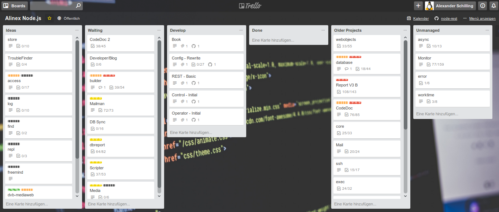

# Project Management

A lot of things can be done using GitHub alone, so at first you don't need more.
But of course there are some extensions like [ZenHub](https://www.zenhub.com/)
or [zube](https://zube.io/) which can also be used.

In GitHub this is done using the Issues and the additional 'Project' tab. Each repository
may have multiple projects.

To have an overview about all the running projects I use [Trello](https://trello.com/)
a free and not so technical planning board.

## Trello

My NodeJS Projects are planned on a specific [board](https://trello.com/b/lOY5hCx7/alinex-node-js).
The cards on this board are EPICS and represents the projects from GitHub (see later).
Each of the column stands for a specific state and will show the project's current
status.

The cards itself contain not much, mostly only the link to the GitHub planning board
as description there more details can be found. It's open source so all is made publicly
readable. Additionally each card is directly linked with it's development repository
branch. 
Sometimes comments or checklists are there as an collection of new information which
was not updated to the real planning board.

## GitHub Setup

The use of GitHub itself has already been described so here we go on with some help
on how to use GitHub with issues and planning.

### Create a new project

Each repository can have multiple projects. You only need a Title and description
to create a new one. After that it should be empty.

### Add columns

The project view comes in form of a Kanban board like often used in Agile Development
and tools like Jira, Trello...

Therefore you have to define your columns. A good starting point will be to
name them.

Simply:
- Waiting
- In Progress
- Done

Agile:
- Backlog
- Ready
- In Progress
- Test
- QA
- Done

### Cards

Within each column you can add cards and drag+drop them between the columns to show
the current state. You have two possibilities of cards:

__Notes__

This are simple information or tasks which only consists of an title. They are only
visible here and can be converted to issues as needed.

__Issues__

That are some real tasks with lots of possibilities:
- More details
- Possible discussion
- Pull Requests
- and more
