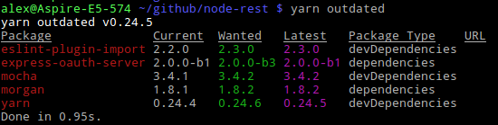
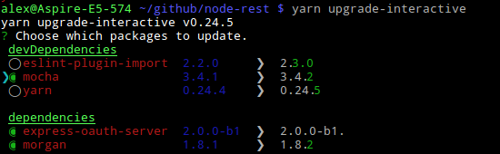

# Package manager

Traditionally `npm` is used as package manager for NodeJS but you may also use the
more modern `yarn` package manager.

Because both are possible to use I will describe both but mainly use Yarn. Maybe
they will come together to the same features in the future.


## NPM

[npm](https://docs.npmjs.com) makes it easy for JavaScript developers to share and
reuse code, and it makes it easy to update the code that you're sharing. npm is
- a package manager for javascript
- a free and open package repository

The npm package repository contains hundreds of thousands of packages. Which can
be easily installed and included in your code. See more of this side at
[publishing](../environment/publish.md).

__Installation__

npm is bundled with NodeJS and installed with it. To update it to the newest version
you may call:

```bash
$ sudo npm update -g npm
```

See the usage below.


## Yarn

[Yarn](https://yarnpkg.com) is a new JavaScript package manager built by Facebook,
Google, Exponent and Tilde. As can be read in the official announcement, its purpose
is to solve a handful of problems that these teams faced with npm, namely:

- installing packages wasn’t fast/consistent enough, and
- there were security concerns, as npm allows packages to run code on installation.

Yarn is only a new CLI client that fetches modules from the npm registry.

__yarn.lock__

In `package.json`, the file where both npm and Yarn keep track of the project’s
dependencies, version numbers aren’t always exact. Instead, you can define a range
of versions. This way you can choose a specific major and minor version of a package,
but allow npm to install the latest patch that might fix some bugs.

In an ideal world of semantic versioning, patched releases won’t include any breaking
changes. This, unfortunately, is not always true. The strategy employed by npm may
result into two machines with the same `package.json` file, having different versions
of a package installed, possibly introducing bugs.

To avoid package version mis-matches, an exact installed version is pinned down in a
lock file. Every time a module is added, Yarn creates (or updates) a `yarn.lock` file.
This way you can guarantee another machine installs the exact same package, while
still having a range of allowed versions defined in package.json.

It is automatically working like npm with `npm-shrinkwrap.json`.

__Parallel Installation__

Whenever npm or Yarn needs to install a package, it carries out a series of tasks.
In npm, these tasks are executed per package and sequentially, meaning it will wait
for a package to be fully installed before moving on to the next. Yarn executes these
tasks in parallel, increasing performance.

__Cleaner Output__

By default npm is very verbose. For example, it recursively lists all installed packages
when running `npm install <package>`. Yarn on the other hand, isn’t verbose at all.
When details can be obtained via other commands, it lists significantly less information
with appropriate emojis.

__Installation__

Use npm to install yarn:

```bash
$ sudo npm install -g yarn
```

To update Yarn run the same call again.


## Management Tasks

The following tasks are often needed and will be displayed how to do them in both.
Other than some functional differences, Yarn also has different commands. Some npm
commands were removed, others modified and a couple of interesting commands were added.

__Install globally__

```bash
# yarn call
$ sudo yarn global add <package>
# npm call
$ sudo npm install -g <package>
```

Unlike npm, where global operations are performed using the `-g` or `--global` flag,
Yarn commands need to be prefixed with global.

__Install Module__

```bash
# yarn call
$ yarn add <package>
# npm call
$ npm install <package> --save
```

This will install dependencies from the `package.json` file and allows you to add
new packages.

For development modules use:

```bash
# yarn call
$ yarn add <package> --dev
# npm call
$ npm install <package> --save-dev
```

__Remove Package__

```bash
# yarn call
$ yarn remove <package>
# npm call
$ npm remove <package> --save
```

This will remove the package and the dependencies from the `package.json` file.

__Outdated packages__

```bash
# yarn call, will ask for new version
$ yarn outdated
# npm call, first set the version in package.json
$ npm outdated
```

This will list the packages which are outdated.



__Upgrade package__

```bash
# yarn call
$ yarn upgrade <package>
# npm call
$ npm update <package> --save
```

This command upgrades packages to the latest version conforming to the version rules
set in `package.json` (and recreates `yarn.lock`).

Interestingly, when specifying a package, it updates that package to latest release
and updates the tag defined in `package.json`. This means this command might update
packages to a new major release.

__Upgrade interactive__

```bash
# yarn call
$ yarn upgrade-interactive
# npm call
$ sudo npm install -g npm-check
$ npm-check -u
```

This tool allows you to interactively decide what to upgrade.



__Run script__

```bash
# yarn call
$ yarn run <script>
# yarn alternative if script name not equal yarn commands
$ yarn <script>
# npm call
$ npm run <script>
```

You can run the scripts defined in `package.json`. With both you can call the
binaries located in `node_modules/.bin` directly without prefixing this path.

__NPM Login__

```bash
# yarn call, will ask for new version
$ yarn login
# npm call, first set the version in package.json
$ npm login
```

Both will ask and store the credentials to access the npm package repository.

__Publish__

```bash
# yarn call, will ask for new version
$ yarn publish <package>
# npm call, first set the version in package.json
$ npm publish <package>
```

While npm published the package using the version from `package.json`, Yarn will
interactively ask for it and update package.json for you.

__License Management__

At the time of writing, no npm equivalent is available. `yarn licenses ls` lists
the licenses of all installed packages. `yarn licenses generate-disclaimer` generates
a disclaimer containing the contents of all licenses of all packages. Some licenses
state that you must include the project’s license in your project, making this a rather
useful tool to do that.

__Yarn Analysis__

This command peeks into the dependency graph and figures out why given package is
installed in your project. Perhaps you explicitly added it, perhaps it’s a dependency
of a package you installed. `yarn why` helps you figure that out.
